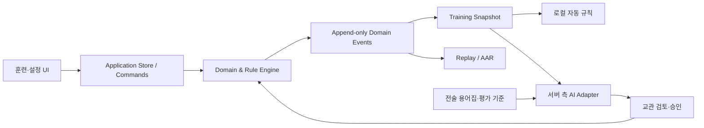

# 전술상황판 프로젝트 계획서

> ## ⚠ §13(작업 순서)은 대체됨
>
> 작업 순서는 [MASTER_PLAN.md](MASTER_PLAN.md) §4로 대체됐다. 이 문서의 나머지(요구사항·설계 근거)는
> 여전히 참고할 수 있으나, 순서가 어긋나면 MASTER_PLAN을 따른다.

> 문서 상태: 기준 계획서 v1.1  
> 작성 기준일: 2026-08-06  
> 적용 프로젝트: `tactical-board`  
> 다음 정기 검토: 단계 종료 또는 핵심 요구사항 변경 시

## 1. 문서 목적

이 문서는 지금까지 분산되어 있던 전술상황판의 개발 이력, 제품 방향, 현재 구현 상태, 기술 부채와 향후 작업을 하나의 기준으로 관리하기 위한 문서다.

문서 목적은 다음과 같이 분리한다.

- 이 문서: 제품 비전, 단계별 로드맵, 파일럿·배포·장기 기능 우선순위
- [`TECHNICAL_IMPROVEMENT_PLAN.md`](./TECHNICAL_IMPROVEMENT_PLAN.md): 반복 장애, 안정화, 리팩터링, 테스트와 기술적 완료 기준
- `PROJECT_OVERVIEW.md`, `FEATURE_STATUS.md`, `DATA_FLOW.md`: 현재 구조와 구현 사실을 설명하는 참고 문서
- `TODO_ROADMAP.md`: 2026-05-05 기준의 과거 작업 목록이며, 검토 후 새 계획으로 이관할 문서

계획 수립에는 다음 자료를 사용했다.

- ChatGPT `tactical-board` 프로젝트의 대화 49개(2026-04-18~2026-06-26)
- Git 커밋 이력(2026-04-19~2026-06-18)
- 2026-08-06 현재 로컬 작업트리와 소스코드
- 기존 문서 `PROJECT_OVERVIEW.md`, `FEATURE_STATUS.md`, `DATA_FLOW.md`, `TODO_ROADMAP.md`
- 빌드, 테스트, 린트 실행 결과

ChatGPT 대화에는 전술상황판과 무관한 데이터분석·일반 문의도 일부 포함되어 있어 제품 요구사항과 직접 관련된 대화만 계획에 반영했다. 대화에서 나온 제안은 실제 코드 또는 사용자의 명시적 결정으로 확인된 경우에만 “완료”로 분류했다.

## 2. 제품 비전

전술상황판은 화재 현장 지휘훈련 중 건물, 출동대, 차량, 구조대상자, 화재·연기, 송수·방수, 돌발상황과 지휘절차를 하나의 화면에서 관리하고 훈련 종료 후 과정을 복기·분석하는 도구다.

장기적으로는 다음 순서로 발전한다.

1. 안정적인 전술상황판
2. 선택된 사용자와 함께하는 통제된 실증·피드백 운영
3. 오프라인에서도 동작하는 규칙 기반 시뮬레이션 엔진
4. 구조화된 로그와 훈련 재생·사후분석
5. AI 상황분석, 이벤트 추천, 평가 보조

AI가 훈련의 유일한 판단 엔진이 되어서는 안 된다. 기본 훈련은 로컬 규칙으로 재현 가능해야 하며, AI는 분석·추천·설명 역할부터 시작한다.

## 3. 핵심 설계 원칙

- 화면에 보이는 정보가 아니라 데이터 상태를 진실의 원천으로 삼는다.
- 동일한 입력과 시드에서는 동일한 결과를 재현할 수 있어야 한다.
- 모든 중요한 상태 변화는 구조화된 이벤트로 남긴다.
- 교관이 자동 이벤트와 AI 추천을 승인·거부·수정할 수 있어야 한다.
- 훈련 중 인터넷이나 AI API가 끊겨도 핵심 기능은 계속 동작해야 한다.
- 브라우저에 전달되는 프런트엔드 코드에는 비밀정보와 API 키를 두지 않는다.
- 사용자 접근권한, 훈련 데이터, 피드백 데이터는 애플리케이션 기능과 별도로 보호한다.
- 큰 기능은 데이터 모델, 규칙, UI, 테스트 순서로 구현한다.

## 4. 지금까지의 진행 이력

### 4.1 2026년 4월: 전술상황판 기반 구축

- 설정화면과 훈련 실행화면 분리
- 건물 A~D면, 층, 대기구역 중심의 레이아웃 구성
- 출동대·차량·구조대상자 토큰 생성과 이동
- 구조대상자 상태, 구조처리, 임시의료소 이동 흐름
- 좌우 패널 접기와 화면 해상도 개선 논의
- 토큰 임무·상태·메모 표시와 메뉴 UI 설계
- 소화전·펌프·물탱크 송수 연결과 시각화 기반 구현
- 화재, 연기, 돌발상황 토큰과 상태 단계 확장
- 이벤트 로그 범위 확대와 훈련 복기 요구사항 확립

### 4.2 2026년 5월: 시뮬레이션 기능 확대

- 방수 표현, 고가차·굴절차 전개와 층 선택
- 차량별 아이콘과 기능 메뉴 개선
- 지휘절차 관리, 시나리오/체크리스트 편집 기능
- 화재 진압 예상시간과 수량을 계산하는 시나리오 예측 기능
- 연기 이미지와 층별 농도 표현 개선
- 프리셋, 이벤트 메시지, 토큰 임무·상태 분리
- 설정·런타임 상태의 `localStorage`/`sessionStorage` 분리
- 규칙 기반 이벤트 엔진과 AI 연동을 위한 요구사항 정의
- 이벤트 소싱 기반 훈련 재생 개념 검토

### 4.3 2026년 6월: 현장 운용 UI와 자원 모델 고도화

- 실내 소화전, 연결송수구, 소방호스·방수 시각화 확대
- 수량 계산, 차량 간 보수, 소화전 급수, 수원 고장·소진 전파
- 체크리스트 및 출동대 상태 UI 개선
- 로그 내보내기와 PDF 확인 보조 도구 추가
- GitHub/Vercel 배포와 오프라인 실행 방법 검토
- 토큰 우클릭 메뉴를 임무·상태·기능·메시지로 재분류

### 4.4 현재 작업트리에서 진행 중인 내용

현재 커밋되지 않은 작업에는 다음 기능이 포함되어 있다.

- 출동대·차량을 종류별 컬럼으로 분류하는 공용 토큰 그리드
- 자원대기소 지정 상태의 전역 관리
- 체크리스트 완료 상태의 전역 관리
- 지휘절차 기반 체크리스트 진행상태를 전술면에 표시
- 인명검색 점수, 1·2차 검색, 구조대상자 발견과 세션 복원
- 대기구역·구조활동통계·전술면 UI 재배치
- ChatGPT 프로젝트 대화 요약 스크립트와 테스트

이 작업은 기능 단위로 분리 커밋하기 전까지 “완료”가 아닌 “통합 검증 중”으로 관리한다.

## 5. 현재 구현 상태

| 영역 | 상태 | 현재 판단 |
|---|---|---|
| 설정/훈련 화면 분리 | 구현 | `/settings`, `/play` 흐름이 존재함 |
| 설정 저장·불러오기 | 구현 | 브라우저 `localStorage` 기반, 파일 가져오기·내보내기 지원 |
| 출동대·차량 배치 | 구현 | 자동 도착, 수동 생성, 이동, 임무·상태·메모 지원 |
| 건물·화재·방화문·연기 | 구현 | 다층 건물, 단계별 화재, 계단실 연기와 상태 로그 지원 |
| 구조대상자 | 구현·확장 중 | 배치·상태·구조·통계 구현, 인명검색 기능은 작업트리에서 통합 중 |
| 송수·방수·수량 | 구현 | 연결·해제, 흐름 표시, 수량 소모·보수, 고장·소진 전파 존재 |
| 고가·굴절차 | 구현 | 전개 높이, 방수 지점, 송수 조건과 시각화 존재 |
| 돌발상황 이벤트 | 구현 | 배치·상태 변경·로그 지원, 자동 규칙 실행은 미구현 |
| 지휘절차·체크리스트 | 구현·확장 중 | 편집과 훈련 체크 지원, 분석·평가 연결은 미완성 |
| 시나리오 예측 | 구현 | 초 단위 화재 진압·수량 예측 UI와 계산 모듈 존재 |
| 이벤트 로그·CSV | 부분 구현 | 주요 로그와 `elapsedSec`, 생성 주체 필드 존재. 완전한 이벤트 소싱 형식은 아님 |
| 훈련 세션 복원 | 부분 구현 | 여러 Context가 `sessionStorage`에 저장되나 단일 스냅샷·재생은 없음 |
| 규칙 이벤트 엔진 | 미구현 | 요구사항과 로드맵만 정의됨 |
| 훈련 재생 | 미구현 | 이벤트 소싱 개념만 검토됨 |
| AI 분석·추천·평가 | 미구현 | API 연결 전 단계로 데이터 기반부터 준비하기로 결정됨 |
| 사용자 인증·권한 | 미구현 | 현재 소스에 로그인, 사용자, 역할, 서버 권한 모델이 없음 |
| 공유 훈련 데이터 | 미구현 | 상태가 브라우저 로컬에 있어 사용자 간 실시간 공유 불가 |
| 자동화 테스트 | 매우 부족 | 앱 핵심 로직 테스트 없음. ChatGPT 요약 스크립트 테스트만 존재 |
| 오프라인 설치형 배포 | 검토 단계 | Node 기반 실행은 가능. Electron/PWA 패키징은 미구현 |

## 6. 현재 품질 기준선

2026-08-06 실행 결과는 다음과 같다.

- `npm run build`: 성공
- 프로덕션 번들: JavaScript 약 514 kB, 500 kB 경고 발생
- ChatGPT 요약 스크립트 테스트: 5개 모두 통과
- `npm run lint`: 54개 오류, 9개 경고
- 기존 계획·현황 문서: 마지막 갱신일이 2026-05-05로 현재 코드와 차이가 큼
- `README.md`: 제품 설명이 아니라 Vite 기본 안내문 상태
- 작업트리: 다수 기능이 한꺼번에 수정되어 있어 회귀 범위를 파악하기 어려움

린트 오류의 주요 유형은 렌더 중 ref 접근, effect 내부 동기 상태 변경, Fast Refresh 규칙 위반, 상수 조건과 Hook 의존성 문제다. 빌드 성공과 실제 운용 안정성은 같은 의미가 아니므로, 파일럿 공유 전에 해결하거나 명시적으로 예외 처리해야 한다.

## 7. 목표 아키텍처

현재는 Context별 상태와 UI 동작이 강하게 결합되어 있다. 다음 단계에서는 기존 기능을 한 번에 교체하지 않고, 공통 이벤트·스냅샷 형식을 먼저 추가한 뒤 핵심 규칙을 점진적으로 도메인 계층으로 이동한다.

## 8. 단계별 로드맵

### 단계 0. 기준선 확정과 안정화

목표: 현재 기능을 잃지 않고 변경 가능한 상태를 만든다.

- 현재 미커밋 변경을 기능별로 분리하고 설명 가능한 커밋으로 정리
- `README.md`를 제품·실행·배포·데이터 저장 방식 중심으로 교체
- 기존 4개 문서를 이 계획서 기준으로 갱신하거나 중복 문서를 통합
- 린트 오류를 기능 오류 가능성과 설정성 오류로 분류해 정리
- 전역 Error Boundary와 사용자 오류 안내 추가
- 사용되지 않는 컴포넌트, 중복 메뉴, 대용량 원본 이미지·PSD 검토
- 번들 분할과 대용량 자산 최적화 검토
- `settingsStorage`, `runtimeSession`, `dispatchRoster`, `scenarioSimulation`, `victimPlacement`, 수량 계산에 단위 테스트 추가
- 주요 훈련 흐름에 브라우저 스모크 테스트 추가
- Git 저장소 공개 범위, Vercel 접근정책, 환경변수와 비밀정보 점검
- 출동대 HTML5 드래그 장애와 별도로 재현된 잔류 `ActionMode` 잠금을 각각 P0 장애로 관리하고, 드래그 시작·payload·드롭 수신 진단과 실행 불가능한 기능 진입 차단을 포함해 `TECHNICAL_IMPROVEMENT_PLAN.md`의 `P0-DRAG-01~04` 수행
- 구조 처리 중 수동 이동 시 `구조중` 상태가 잔류하는 오류를 수정하고 구조 처리 상태를 세션 복원 가능하게 정비
- 임시의료소의 설치 상태와 담당 출동대·소장 지정을 별도 상태와 UI로 분리

완료 기준:

- 빌드·린트·핵심 테스트가 모두 통과하거나 승인된 예외가 문서화됨
- 새 환경에서 설치·빌드·실행 절차를 README만 보고 재현 가능
- 현재 주요 훈련 시나리오의 수동 회귀 체크리스트가 존재
- 기준선 커밋과 배포 버전을 연결할 수 있음
- 훈련 진행·방수·작업 모드 사용 후에도 출동대와 구조대상자 이동 회귀 테스트가 통과함

### 단계 1. 선택 사용자 파일럿과 피드백

목표: 소수 사용자에게 안전하게 공개하고 실제 사용 피드백을 수집한다.

- 인증 방식과 허용 사용자 목록 결정
- 최소 역할 정의: 관리자, 교관, 관찰자/테스터
- Vercel 또는 애플리케이션 계층에서 접근 게이트 적용
- 운영·테스트 배포 분리
- 앱 버전, 브라우저, 재현 절차를 포함하는 피드백 양식 제공
- 기능 제안, 사용성 문제, 오류를 분리해 수집
- 민감한 훈련정보와 개인정보를 피드백에 넣지 않도록 안내
- 실제 사용자 피드백을 우선순위 백로그에 연결

주의사항:

- 프런트엔드 번들은 사용자 브라우저로 전달되므로 화면 로직을 완전히 숨길 수 없다.
- Git 저장소 비공개 여부와 서비스 접근제어는 서로 다른 문제다.
- API 키와 관리자 비밀정보는 반드시 서버 측에만 둔다.
- 현재는 로컬 브라우저 저장 방식이므로 사용자별 데이터와 공유 세션의 범위를 먼저 정의해야 한다.

완료 기준:

- 허용된 사용자만 배포판에 접근 가능
- 사용자별 권한이 정의되고 최소 권한 원칙이 적용됨
- 피드백이 버전·화면·재현 단계와 함께 수집됨
- 파일럿 데이터에 비밀정보가 포함되지 않음

### 단계 2. 훈련 데이터 기반 정비

목표: 규칙 엔진, 재생, AI가 공통으로 읽을 수 있는 데이터 계약을 만든다.

- 중앙 `TrainingClock` 정의
- `TrainingSnapshotV1` 설계 및 `buildTrainingSnapshot()` 구현
- `DomainEventV1` 설계
  - `eventId`, `elapsedSec`, `entityType`, `entityId`, `action`
  - `before`, `after`, `source`, `metadata`, `schemaVersion`
- 기존 `LogEntry`는 화면 표시용 projection으로 전환
- 모든 중요 상태 변경을 하나의 command/event 경로로 통과
- 초기 스냅샷 + 이벤트로 특정 시점 상태를 복원하는 replay prototype 구현
- 저장 데이터에 schema version과 migration 정책 추가
- 전술 용어집과 상태 해석 기준서 작성
  - 1선펌프, 중요물탱크, 자원대기소, 대기1단계, 직전대기, 임시의료소
  - 송수, 방수, 인명검색, 초진·완진 등

완료 기준:

- 실행 중 어느 시점에도 단일 JSON 스냅샷을 생성할 수 있음
- 핵심 사용자 동작이 구조화 이벤트로 기록됨
- 저장된 이벤트로 토큰 위치·상태의 주요 흐름을 재생할 수 있음
- 스냅샷과 이벤트 스키마에 자동화 테스트가 있음

### 단계 3. 규칙 기반 이벤트 엔진

목표: 인터넷이나 AI 없이도 예측 가능하고 검증 가능한 자동 이벤트를 실행한다.

- `Rule`, `Condition`, `Action`, `priority`, `cooldown`, `enabled` 모델 정의
- 규칙 실행 주기와 중앙 스케줄러 정의
- 시드 기반 난수로 반복 가능한 훈련 지원
- 수동 이벤트와 자동 이벤트 분리
- 교관이 규칙 활성화, 일시정지, 강제실행, 취소 가능
- 기존 WaterLevel·화재·고장 전파 로직을 UI Context에서 순차 분리
- 1차 규칙 세트 구현
  - 송수 미확보 또는 수원 소진에 따른 방수 중단
  - 화재층 방수 부족에 따른 정체·확대
  - 펌프·물탱크·소화전 고장의 하위 영향 전파
  - 계단실 연기와 방화문 상태 연동
  - 구조대상자 발견·상태 악화·처치 지연
  - 임시의료소·자원대기소 운영 상태
- 규칙 발동 근거를 로그에 저장

완료 기준:

- 대표 규칙별 Given/When/Then 테스트 통과
- 동일한 초기상태와 시드에서 동일한 결과 생성
- 규칙 엔진 중단 시 수동 훈련 기능은 계속 사용 가능
- 자동 이벤트가 언제, 어떤 근거로 발동했는지 설명 가능

### 단계 4. 훈련 재생과 사후분석(AAR)

목표: 훈련 종료 후 행동 순서와 판단 시점을 객관적으로 검토한다.

- 시간 슬라이더 기반 상태 재생
- 체크리스트 완료 시각과 상태 변화 연결
- 주요 지표 정의
  - 최초 상황보고, 지휘권 선언, 1선펌프·중요물탱크 지정
  - 송수 확보, 최초 방수, 구조 시작·완료, 초진·완진
  - 위험 상태 지속시간과 대응 지연
- 수동 기록과 시스템 이벤트 구분
- CSV 외 JSON 훈련 패키지 내보내기·가져오기
- 분석 결과가 원본 이벤트까지 추적 가능하도록 근거 링크 제공

완료 기준:

- 훈련 한 건을 저장·불러오기·재생할 수 있음
- 주요 지표가 수기 계산과 일치
- 분석 결과가 근거 이벤트와 시간으로 설명됨

### 단계 5. AI 분석·이벤트 추천·평가 보조

목표: 규칙 엔진을 대체하지 않고 교관의 판단을 보조한다.

- AI 호출은 프런트엔드가 아닌 서버 측 adapter를 통해 수행
- 입력은 `TrainingSnapshotV1`과 최근 구조화 이벤트로 제한
- 전술 용어집, 판단규칙, 금지판단, 예시상황을 버전 관리
- 출력 JSON 스키마 정의 및 유효성 검증
- 1차: 상황 요약과 위험요인 설명
- 2차: 이벤트 추천과 근거 제시
- 3차: 교관 승인 후 이벤트 적용
- 4차: AAR 초안과 평가 보조
- 정답이 있는 평가 시나리오와 금지판단으로 검증 세트 구축
- 응답 지연, 비용, 실패, 오프라인 fallback 정의
- 무전·음성 기능은 별도 후속 단계로 관리

완료 기준:

- AI 응답 실패가 훈련 진행을 방해하지 않음
- 추천 이벤트는 교관 승인 전 상태를 변경하지 않음
- 모든 추천에 사용한 스냅샷·규칙 버전·근거가 저장됨
- 사전 검증 세트에서 허용 기준을 충족

### 단계 6. 배포·오프라인 패키징 고도화

목표: 웹과 오프라인 훈련환경을 모두 지원한다.

- GitHub/Vercel 배포 절차와 롤백 절차 문서화
- PWA, Electron, Tauri 중 설치형 배포 방식 결정
- 완전 오프라인 설치·업데이트·백업 절차 검증
- 훈련 데이터 내보내기와 버전 호환 정책 확립
- 환경별 자동 빌드와 릴리스 노트 생성

## 9. 우선순위 백로그

### P0 — 파일럿 전에 반드시 처리

- 미커밋 작업 분리·검증·기준선 커밋
- 린트 오류 분류와 핵심 오류 해결
- 앱 핵심 로직 테스트 추가
- README 및 현황 문서 최신화
- 사용자 접근제어·저장소·배포 보안 검토
- Error Boundary와 오류 수집 경로 추가
- 수동 회귀 테스트 시나리오 작성
- 출동대·구조대상자 간헐적 이동 불가 원인 확정 및 수정
- ActionMode 성공·실패·취소·원본 소멸 시 상태 정리 보장
- 공통 드래그 좌표 보정의 유효성 검사와 중첩 드롭 회귀 테스트 추가
- 구조 처리 자동 완료·수동 이동·새로고침에서 타이머와 `구조중` 상태 일치 보장
- 임시의료소 설치/미설치 버튼과 담당자 선택 UI 분리

### P1 — 제품 기반

- `TrainingSnapshotV1`
- `DomainEventV1`
- 중앙 훈련 시계
- 이벤트 기반 재생 prototype
- 전술 용어집·규칙 기준서
- 설정·세션 스키마 버전 관리

### P2 — 시뮬레이션 핵심

- 규칙 엔진 프레임
- 물·화재·고장 로직의 도메인 계층 분리
- 자동 이벤트 관리 UI
- 구조대상자 인명검색 통합 마무리
- 지휘절차·체크리스트와 분석 지표 연결

### P3 — 확장

- AI 상황분석과 이벤트 추천
- AAR 초안·평가 보조
- 실시간 공유 훈련 세션
- 무전/STT/TTS 및 훈련 데이터 생성
- 오프라인 설치형 앱

## 10. 주요 위험과 대응

| 위험 | 영향 | 대응 |
|---|---|---|
| 대규모 미커밋 변경 | 회귀·손실·원인 추적 어려움 | 기능별 커밋, 기준선 태그, 회귀 체크리스트 |
| Context와 UI에 규칙 분산 | 규칙 중복, AI·재생 확장 어려움 | command/event와 domain engine을 점진 도입 |
| 브라우저 저장 의존 | 기기 변경·삭제 시 데이터 손실 | JSON 백업, schema version, 이후 서버 저장 선택 |
| 문자열 중심 로그 | 정확한 재생·평가 불가 | 구조화 이벤트를 원본, 문자열 로그를 projection으로 변경 |
| AI를 먼저 연결 | 비용·불안정·설명 불가 | 스냅샷·규칙·검증세트를 먼저 완성 |
| 프런트엔드 비밀정보 | 키·내부정보 노출 | 서버 측 adapter, 환경변수 검토, 클라이언트 키 금지 |
| 접근제어 없이 공개 | 승인되지 않은 사용·데이터 노출 | allowlist, 역할, 운영/테스트 분리 |
| 자동화 테스트 부족 | 수정 시 기존 기능 파손 | 순수 로직 단위 테스트와 핵심 흐름 E2E 추가 |
| ActionMode·메뉴 상태 해제 누락 | 정상 사용 중 토큰 이동 등 핵심 조작이 갑자기 잠김 | 상태 생명주기 명시, 자동 정리, 활성 상태 진단, 취소 경로 테스트 |
| 이원화된 토큰 이동 방식 | 돌발 아이콘과 출동대·구조대상자의 오류 양상이 달라 원인 추적 어려움 | 공통 이동 계약, 드래그 가능 조건 중앙화, Pointer Events 통합 검토 |
| 드래그 좌표 보정 회귀 | 토큰이 이동하지 않거나 잘못된 위치에 저장됨 | 유효성 검사, 안전한 fallback, 구역 간 자동 회귀 테스트 |
| 구조 처리 상태 정리 누락 | `구조중` 표시 잔류, 출동대 재선택 불가, 타이머 불일치 | 종료 경로 통합, 타입이 있는 업무 상태, 세션 복원 테스트 |
| 임시의료소 상태 의미 혼합 | 설치 여부가 출동대명으로 바뀌고 화면 전환 시 상태 초기화 | 설치 상태와 담당자 분리, 토큰 ID 저장, 세션 Context 중앙화 |
| 번들·이미지 증가 | 초기 로딩과 저사양 PC 성능 저하 | 코드 분할, 자산 압축, 성능 기준 설정 |
| 규칙의 현장 타당성 부족 | 잘못된 훈련 결과 | 현장 전문가 검토, 규칙 버전, 근거와 조정값 기록 |

## 11. 결정이 필요한 항목

다음 항목은 구현 전에 사용자의 선택 또는 현장 검토가 필요하다.

1. 파일럿 인증 방식과 허용 사용자 관리 주체
2. Git 저장소를 공개·비공개 중 어떤 방식으로 운영할지
3. 사용자별 독립 훈련과 여러 사용자의 공동 훈련 중 우선 대상
4. 훈련 데이터의 서버 저장 여부와 보존기간
5. 송수 연결의 허용 방향과 예외
6. 화재 자연증가율·임계 소방력·상층 연소확대 기준
7. 규칙 이벤트의 자동실행과 교관 승인 범위
8. 초급 이후 중급·고급 지휘절차의 평가 기준
9. AI 서비스·모델 선택과 월 비용 한도
10. PWA/Electron/Tauri 중 오프라인 배포 방식

## 12. 계획 관리 방식

- 이 문서를 제품 로드맵의 기준으로 사용하고, 기술 안정화 실행은 `TECHNICAL_IMPROVEMENT_PLAN.md`에서 관리한다.
- 작업은 `P0~P3`, 단계, 완료 기준 중 하나에 연결한다.
- 새 요구사항은 바로 개발하지 않고 목적, 데이터 변화, UI 변화, 로그·테스트 영향을 먼저 기록한다.
- 완료 표시는 빌드 성공만으로 하지 않고 완료 기준과 회귀 테스트 통과 후 갱신한다.
- ChatGPT에서 나온 아이디어는 “제안”, 사용자 확인을 거친 것은 “결정”, 코드와 테스트로 검증된 것은 “구현”으로 구분한다.
- 단계가 끝날 때 이 문서의 구현 상태, 위험, 결정사항과 다음 3개 작업을 갱신한다.
- 반복 장애는 증상, 재현 조건, 원인 후보, 수정, 회귀 테스트, 배포 버전을 기술 개선 계획에 남긴다.

## 13. 바로 이어서 할 작업

1. 출동대·구조대상자 간헐적 이동 불가의 재현 절차와 실패 상태를 확정한다.
2. `P0-DRAG-01~04`를 수행하고 훈련 진행·방수 중 이동 회귀 테스트를 추가한다.
3. `P0-RESCUE-01~02`를 수행해 자동 완료·수동 이동·새로고침의 구조 상태를 일치시킨다.
4. `P0-MED-01~02`를 수행해 설치 상태와 담당자 UI·세션 상태를 분리한다.
5. 현재 작업트리의 변경사항을 기능별 목록으로 확정하고 사용자 작업과 도구성 스크립트를 분리한다.
6. 앱의 실제 사용 흐름을 기준으로 수동 회귀 체크리스트를 만든다.
7. 린트 오류 54개를 런타임 위험, 구조 개선, 규칙 예외로 분류한다.
8. `README.md`와 2026-05-05 기준의 기존 문서를 현재 상태로 갱신한다.
9. 선택 사용자 파일럿을 위한 인증·접근제어 방식을 결정한다.
10. `TrainingSnapshotV1`과 `DomainEventV1` 설계 문서를 작성한다.

이 여섯 작업이 끝난 뒤 규칙 이벤트 엔진 구현을 시작한다.
